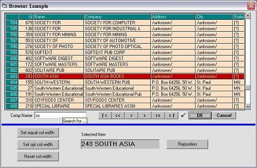



## DAO Database Browser OCX Control

### Description

This is a prefabricated database browser to be used with bookmark- and clone-supporting SQL databases (MS-Access for example). It lets the user browse a database or search for specific entries and then select an entry for further processing. The appearance and contents are customizable.

Everything above the blue line is part of the OCX Control. Simply stick it in a form, set a few properties and you're go with a commercial quality browser/record selector.

A cross linked help file is included. Download is only 20.5 kB.
 
### More Info
 

             |
---                |---
**Submitted On**   |2002-04-10 09:36:40
**By**             |[ULLI](https://github.com/Planet-Source-Code/PSCIndex/blob/master/ByAuthor/ulli.md)
**Level**          |Advanced
**User Rating**    |4.8 (53 globes from 11 users)
**Compatibility**  |VB 6\.0
**Category**       |[Databases/ Data Access/ DAO/ ADO](https://github.com/Planet-Source-Code/PSCIndex/blob/master/ByCategory/databases-data-access-dao-ado__1-6.md)
**World**          |[Visual Basic](https://github.com/Planet-Source-Code/PSCIndex/blob/master/ByWorld/visual-basic.md)
**Archive File**   |[DAO\_Databa706554102002\.zip](https://github.com/Planet-Source-Code/ulli-dao-database-browser-ocx-control__1-33662/archive/master.zip)

